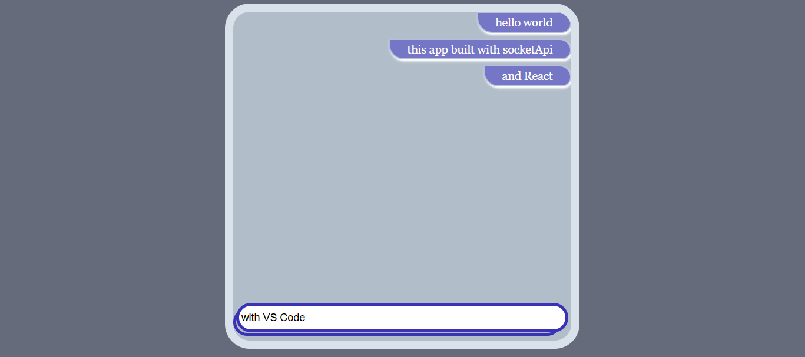

  📌📌 This project was developed under the supervision of an instructor within the scope of Partika Software Training.
The code structure and architecture were created by the instructor, while the overall design layout, component placement, and visual style were chosen by me.
📄 This work reflects the experience I gained during my learning process and my front-end practice.

# Socket API Project (React)
A modern React + Socket.io project developed for real-time data communication.
This project manages socket connections on the client side and provides the infrastructure for features 
such as instant messaging and data synchronization.

🚀 Features

⚡ Real-time communication (Socket.io)

🧩 Structured architecture with React Hooks and Context API

🛠️ Easy configuration and development environment

🌐 Bidirectional data flow (client ↔ server) with API

✨✨ ScreenShot

